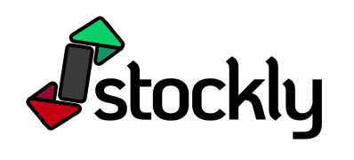

  

# Stockly

Stockly is a machine learning–based web application that predicts future stock prices using historical market data. The app provides a simple interface where users can choose a stock and instantly receive a model-generated prediction.

## Features

* LSTM-based stock price forecasting
* Automated data preprocessing (scaling, sequence generation)
* Flask backend with a clean and fast UI
* Deployed on Railway
* Easily extensible for new tickers or updated models

## How It Works

1. Historical price data is collected for the selected stock.
2. Data is scaled and converted into training sequences.
3. A trained LSTM model predicts the next closing price.
4. The prediction is displayed to the user through the web interface.

## Tools Used

* Python, Flask
* TensorFlow/Keras
* NumPy, Pandas, Scikit-learn
* Railway for deployment
